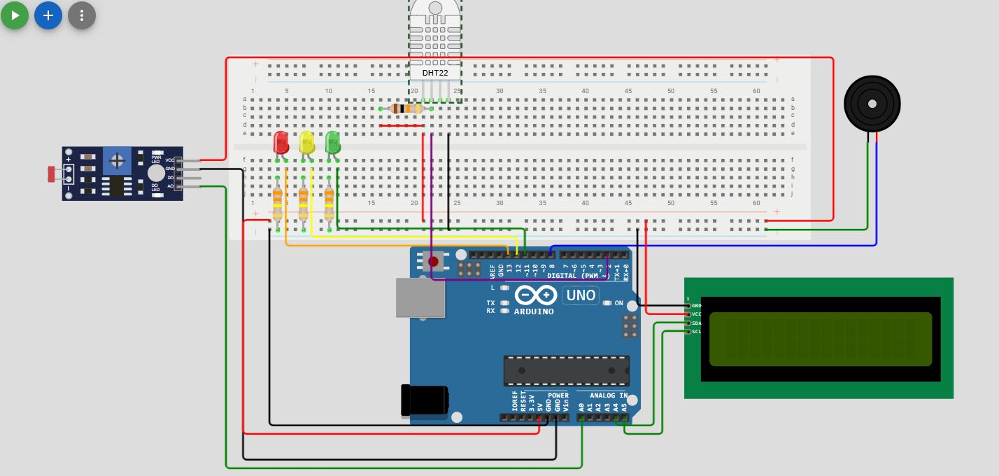

<h1 align="center">🚀 Sensor de Luminosidade, Temperatura e Umidade para Vinheria Agnello 💡🌡💧</h1>

  <strong>🚨 🔧 💡</strong>

  Um projeto incrível com Arduino, LDR e DHT22 (Light Dependent Resistor)!

# Equipe
- Giovana Bernardino Carnevali 566196
- João Vitor Parizotto Rocha 562719
- Alexandre Freitas Silva 566278
- Felipe Rodrigues Gomes Ribeiro 562482

## 🎯 Objetivo
Desenvolver um sistema de monitoramento de luminosidade, temperatura e umidade utilizando Arduino, capaz de identificar níveis de luz, temperatura e umidade inadequados no ambiente de armazenamento de vinhos da Vinheria Agnello. O sistema sinaliza a condição do ambiente por meio de LEDs, alarme sonoro, e um LCD garantindo que os vinhos sejam preservados em condições ideais.

## 🛠️ Componentes
- 1 Arduino Uno
- Arduino IDE
- 1 protoboard
- 1 Led Vermelho
- 1 Led Amarelo
- 1 Led Verde
- 3 resistores de 330Ω
- 1 resistor 10kΩ
- 1 buzzer
- 1 LDR
- 1 DHT22
- 1 LCD
- jumpers

## 📚 Bibliotecas
- DHT22
- LiquidCrystal I2C
- Adafruit Unified Sensor
- DHT sensor library

## 📝 Passo a passo interativo

Siga os passos abaixo para iniciar o projeto em seu ambiente local:

1️⃣ **Copie o código no Arduino IDE ou em um simulador**

2️⃣ **Monte o circuito**

   Com a tenção e cuidado monte o seguinte circuito, mas lembre-se, existe outras maneiras de montagem.

3️⃣ **Compilar o código**

   Após certificar-se que o arduino está conectado a máquina, compilar seu código ultilizando o atalho ctrl+R ou cessar o comando de compilar na aba Sketch -> Verify/Compile. Em caso de erro, corrigir o código, caso o código estaja correto mas mesmo assim nada acontecer, revise o circuito.

4️⃣ **Confira o resultado**
Teste diferentes iluminações, umidades e temperaturas e observe o resultado.
https://wokwi.com/projects/427795791611350017

  Espero que este guia tenha sido útil e que você consiga reproduzir esse projeto.🎉😄

